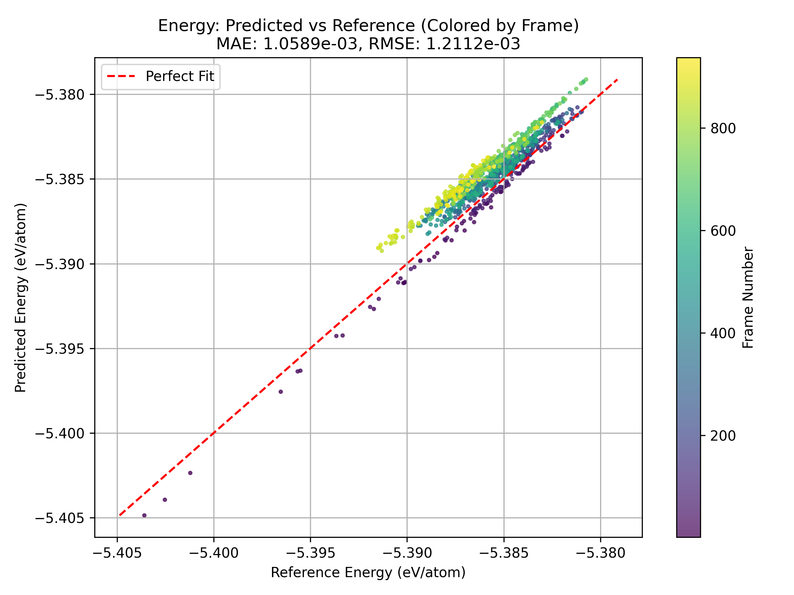
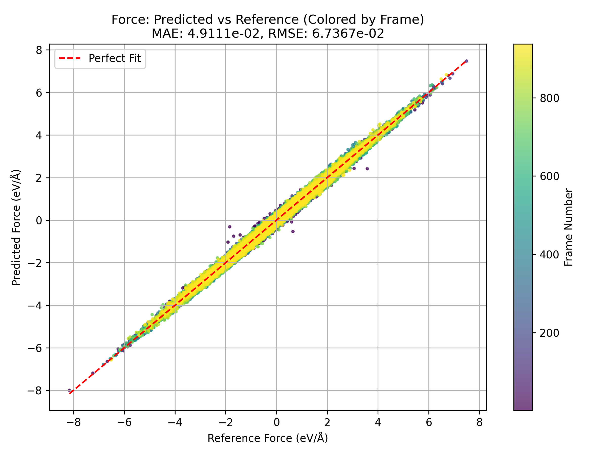
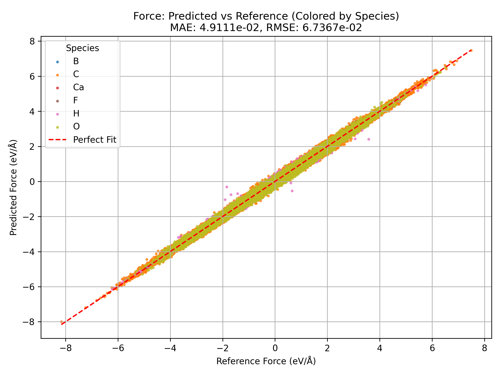
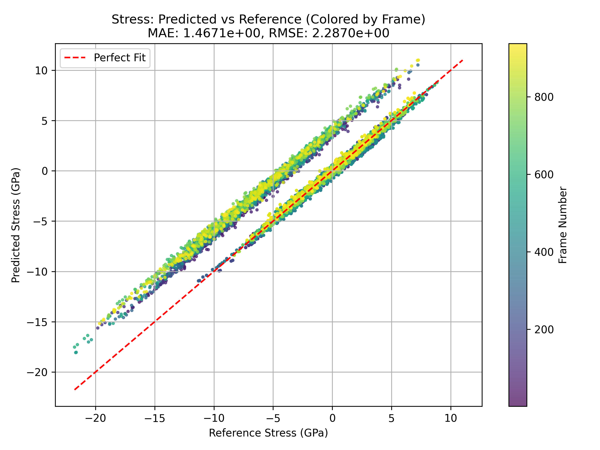

==================================

DeePMD Result Plotting & Testing

==================================

This repository contains scripts to automate the generation, testing, and analysis of Deep Potential Molecular Dynamics (DeePMD) models. The main components are:

1. EvaluateDP.py
   - Orchestrates model freezing, compression, and testing for each new version of your DeePMD models.
2. Outliers.py
   - Identifies frames with the highest errors in energies, forces, and stresses; exports those frames for inspection.
3. Plot.py
   - Produces diagnostic plots (energy, force, stress) to compare model predictions with reference data.

------------------------
1. Repository Structure
------------------------

A typical file/folder structure (simplified) might look like this:

    ├── EvaluateDP.py
    ├── 1.FC/
    │   ├── graph.pb
    │   ├── ...
    ├── 1.TEST_DATA/
    │   ├── RESULTS.e.out
    │   ├── RESULTS.f.out
    │   ├── RESULTS.v_peratom.out
    │   ├── Plot.py
    │   ├── Outliers.py
    │   ├── energy_frame_plot.png
    │   ├── force_frame_plot.png
    │   ├── force_species_plot.png
    │   ├── stress_frame_plot.png
    │   └── ...
    ├── 0.TESTING_DATA/
    │   └── 1.Ver_1/
    │       ├── deepmd_data/
    │       └── scripts/
    │           ├── Plot.py
    │           └── Outliers.py
    ├── dp_test.log
    ├── README.txt  <-- (this file)
    └── ...

- **X.FC** directories (e.g. `1.FC`, `2.FC`, etc.) store the frozen/compressed DeePMD models (`graph.pb`, `graph-compress.pb`).
- **X.TEST_DATA** directories (e.g. `1.TEST_DATA`, `2.TEST_DATA`, etc.) store the results of `dp test` plus the analysis plots and outlier info.
- **0.TESTING_DATA** stores external “Version” directories (e.g. `1.Ver_1`, `2.Ver_2`) that contain raw data (`deepmd_data`) and optional scripts.

------------------------------
2. Main Script: EvaluateDP.py
------------------------------

**EvaluateDP.py** (also referred to as *run_dp_tests.py*) automates the entire workflow:

1. **Scans** an external parent directory for subfolders matching `*Ver_*` – these are new DeePMD versions.
2. **Checks** which versions have been tested by reading existing `X.TEST_DATA` directories and their `external_version.txt` markers.
3. For **any new version** not yet tested:
   - Finds or creates an **FC directory** (e.g. `1.FC`) containing `graph.pb`, `graph-compress.pb`.
   - Creates a **new TEST_DATA directory** (e.g. `2.TEST_DATA`), writes the version name, symlinks `deepmd_data`, copies model files, then runs:
     
         dp test -m graph.pb -s ./deepmd_data/ -d RESULTS

   - Captures the test output in `RESULTS.txt`, then (if present) runs `Plot.py` and `Outliers.py` via conda to generate plots and outlier info.

Usage:

    python EvaluateDP.py [--dry-run]

- **--dry-run**: Shows actions without executing them (no directories created, no commands run).
- By default, logs detailed information to **dp_test.log**.

Dependencies:

- **Python 3**
- **deepmd-kit** (for `dp freeze`, `dp compress`, `dp test`)
- **dpdata** (for reading/writing structures in `Outliers.py`)
- **numpy**, **matplotlib** (for data and plotting)
- A conda environment named **SciFy2** is assumed when running `Plot.py` and `Outliers.py`.

------------------------------
3. Outliers Analysis: Outliers.py
------------------------------

**Outliers.py** is automatically invoked (if present) after `dp test`. It:

1. **Loads** reference data (energies, forces, stresses) vs. predicted data from files like `RESULTS.e.out`, `RESULTS.f.out`, `RESULTS.v_peratom.out`.
2. **Identifies** frames with the largest errors:
   - **Energy** error (absolute error per frame, per atom).
   - **Forces** error (mean force error per frame).
   - **Stresses** error (mean relative stress error).
3. **Exports** the top outlier frames into separate directories (`energy_outliers/`, `force_outliers/`, `stress_outliers/`) with `POSCAR_*` files for further inspection.
4. **Generates** overview plots (`trajectory_errors.png`, `energy_error.png`, `force_error.png`, `stress_error.png`) across frames.

Run directly:

    conda run -n SciFy2 python Outliers.py

-----------------------
4. Plotting: Plot.py
-----------------------

**Plot.py** creates specialized plots for energies, forces, and stresses, including:

- **Predicted vs. Reference** scatter plots with a diagonal “perfect agreement” line.
- **Error Distributions** (histograms).
- **Frame-by-Frame** plots (colored by frame index or by species).
- **Stress Components** individually (e.g. `vxx`, `vxy`, etc.).

It expects files like `RESULTS.e_peratom.out`, `RESULTS.f.out`, `RESULTS.v_peratom.out`. You can customize it as needed.

Run:

    conda run -n SciFy2 python Plot.py

----------------------------
5. Example Generated Plots
----------------------------

Below are sample plots that might appear in a `X.TEST_DATA` folder. Actual filenames and images depend on your data:

- **Energy Error Over Frames**  
  

- **Force Error Over Frames**  
  

- **Force Colored by Species**  
  

- **Stress Error Over Frames**  
  

--------------------
6. Getting Started
--------------------

1. **Install** required packages:

       conda create -n SciFy2 python=3.9
       conda activate SciFy2
       conda install deepmd-kit dpdata numpy matplotlib

2. **Clone** this repo and place your data in a structure like `0.TESTING_DATA/1.Ver_1/deepmd_data/`.
3. **Set** `EXTERNAL_PARENT` in `EvaluateDP.py` to point to your `0.TESTING_DATA` directory.
4. **Run**:

       python EvaluateDP.py
       # or:
       python EvaluateDP.py --dry-run

5. **Check** logs in `dp_test.log`.

--------------------
7. Tips & Notes
--------------------

- **Multiple Versions**: If you have multiple `*Ver_*` folders (e.g. `1.Ver_1`, `2.Ver_2`), `EvaluateDP.py` will process each new version in sequence.
- **Re-Testing**: To re-test a version, remove or rename its corresponding `X.TEST_DATA` folder so it appears untested.
- **Log Files**: Check `dp_test.log` for detailed output.
- **Custom Scripts**: If your version folder has a `scripts/` directory, those scripts (e.g. `Plot.py`, `Outliers.py`) will be symlinked into the test folder to ensure consistent post-processing.
- **Outlier Directories**: `force_outliers`, `energy_outliers`, and `stress_outliers` hold frames with the largest errors, handy for diagnosing specific configurations.

-----------------
8. Contributing
-----------------

Open issues or pull requests for improvements, suggestions, or new features.

--------------
9. License
--------------

Provided under an open license (e.g. MIT, Apache). Adapt as needed for your project.

------------------------
Thank you for reading!
------------------------
